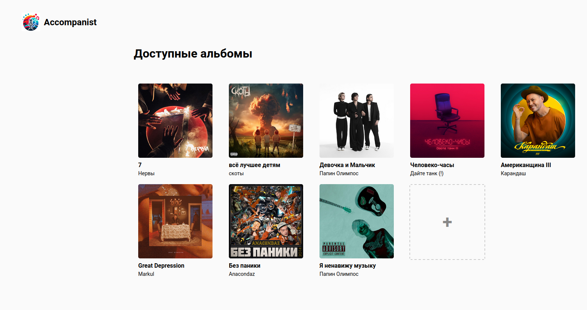
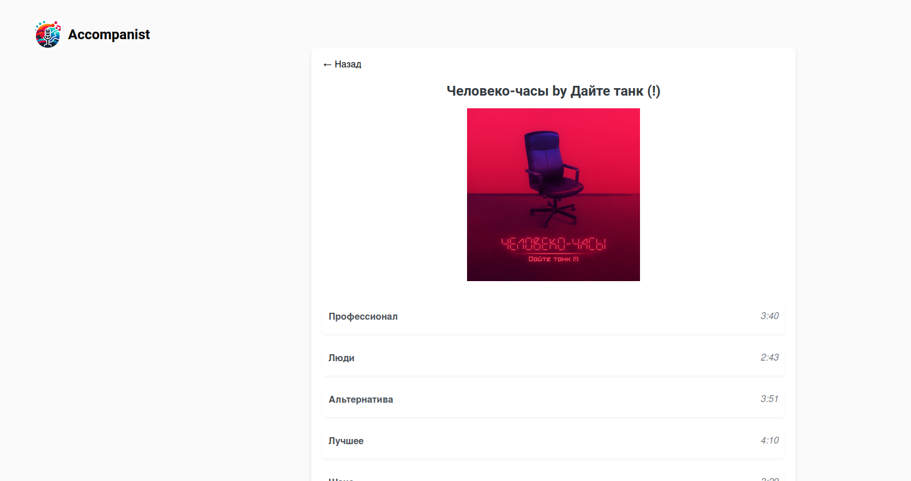

## Accompanist — a self-hosted karaoke system with AI

<div style="text-align: center">
    
</div>


<div style="text-align: center">
    
</div>

### How to run

Prerequisites: Docker

Install nvidia-container-runtime to use GPU inside Docker containters as
follows. Actually, you can skip this part and remove "deploy" section in
`compose.yaml`. But in this case, the track processing time will increase
significantly, so better do it, if you have a GPU. You can also skip this step
and run celery worker locally without Docker (see "Running backend locally").

```
curl -fsSL https://nvidia.github.io/libnvidia-container/gpgkey | sudo gpg --dearmor -o /usr/share/keyrings/nvidia-container-toolkit-keyring.gpg \
  && curl -s -L https://nvidia.github.io/libnvidia-container/stable/deb/nvidia-container-toolkit.list | \
    sed 's#deb https://#deb [signed-by=/usr/share/keyrings/nvidia-container-toolkit-keyring.gpg] https://#g' | \
    sudo tee /etc/apt/sources.list.d/nvidia-container-toolkit.list
sudo apt-get update
sudo apt-get install -y nvidia-container-toolkit
sudo systemctl restart docker
```

How to run the system:

```
git clone https://github.com/m-danya/accompanist
cd accompanist
cp .env.sample .env
```


Since this project uses Genius API for obtaining lyrics for tracks, you need to
get token for Genius API. In can be done in 90 seconds:

Go to [https://genius.com/api-clients](https://genius.com/api-clients) and
obtain *Client Access Token*. You can enter any app name an use any "App Website
URL". After you get the token, place it into your `.env` file (corresponding
variable is `GENIUS_CLIENT_ACCESS_TOKEN`).

Let's continue:

```
mkdir storage-volume
docker-compose up -d --build
docker exec -it accompanist-backend-1 alembic upgrade head
# open http://localhost in your browser
```

## Development notes

This project uses `ruff` for formatting and linting. For VS Code, just install
the "Ruff" extension and reload the editor.

If you're using VS Code, install these extensions for frontend development: "Vue
- Official" and "Prettier".

The `.vscode/launch.json` file is included in this repo to help developers to
easily run the frontend and backend locally. To run the system locally, you need
to follow the instructions both above and below this paragraph.

If you want to run backend and frontend without Docker, you still need these
containers to be running:

```
docker compose up -d nginx db rabbitmq
```

### Running frontend locally

```
cd frontend
nvm install 20
nvm use 20
npm install -g @vue/cli
npm install
# run "Vue.js" configuration in VS code or:
npm run serve
```

### Running backend locally

```
sudo apt install python3.10 python3.10-venv
python3.10 -m venv venv
source venv/bin/activate
poetry install

# 1. Running FastAPI backend
# run "FastAPI" configuration in VS code or:
STORAGE_PATH=./storage-volume uvicorn accompanist.main:app --reload

# 2. Running Celery  worker for processing albums
# run "Celery worker" configuration in VS code or:
STORAGE_PATH=./storage-volume celery -A accompanist.celery.main.app worker --loglevel info -E
```

### Local network deployment

You may want to deploy this app in your local network, for example, to access it
from your mobile device, connected to the same Wi-Fi network. In this case, just
change the `DEPLOYMENT_HOST` variable in your `.env` file from `127.0.0.1` to
your local IP address (look for an IP address like `192.168.1.7` in the output
of `ifconfig`). After `docker compose up -d --build`, you will be able to access
the system at `${DEPLOYMENT_HOST}:${DOCKER_FRONTEND_PORT}`.

## TODOs

#### Possible todos

- [All the "TODO"s in the code]
- Showing lyrics (as in karaoke): API vs self-labeling
- Collection management: order of albums / stars / rating
- Add editing text from frontend (to edit Genius parser's mistakes)
- Run `alembic upgrade head` at launching?
- Publish docker image(s) to Docker Hub
- Frontend localization
- Add Telegram bot wrapper for the backend
- Add mypy (+ CI)
- Add tests