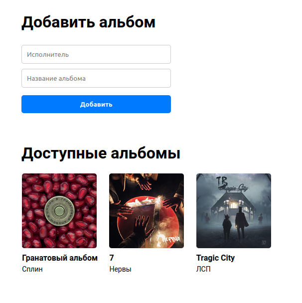

## Accompanist — a self-hosted karaoke system with AI

<div style="text-align: center">
    
</div>

<div style="text-align: center">
    
</div>


(not yet released)

## Development notes

This project uses `ruff` for formatting and linting. For VS Code, just install
the "Ruff" extension and reload the editor.

### General

```
cp .env.sample .env
docker-compose up -d --build
```

### Frontend

```
cd frontend
nvm install 20
nvm use 20
npm install -g @vue/cli
npm install
npm run serve
```

### TODOs

#### Necessary todos

- Print traceback of errors

#### Possible todos

- Publish docker image(s) to Docker Hub
- Frontend localization
- Add Telegram bot wrapper for the backend
- Add mypy (+ CI)
